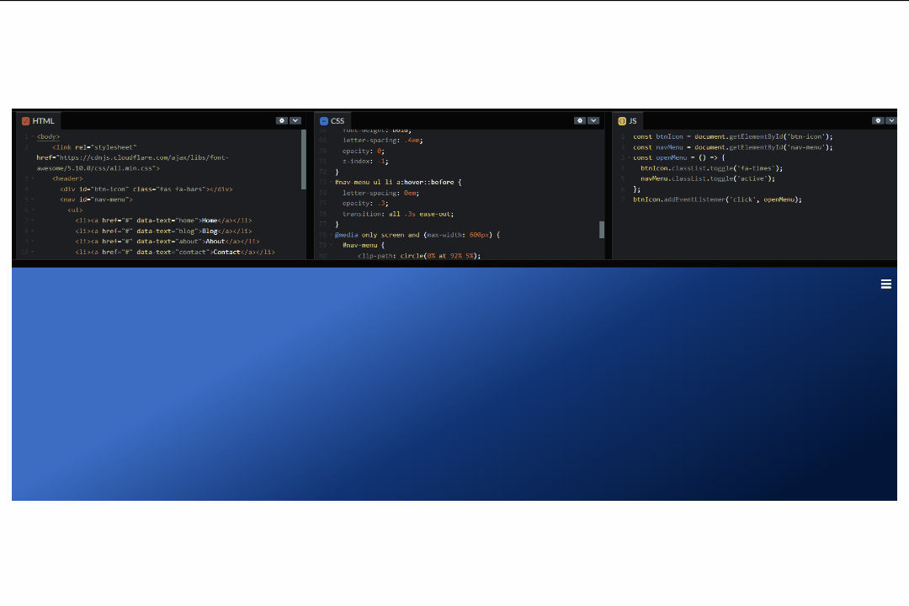

### Sobre o projeto
##

"Este projeto está licenciado sob os termos da licença MIT."

Esse é um projeto simples porém incrível, por ser diferente a forma que esse menu é apresentado.

Como podem ver no gif abaixo ao clicar no hamburger o menu abre com efeito radio usando clip-path do css3, espero que gostem.

O melhor ele é responsivo 🚀

    

